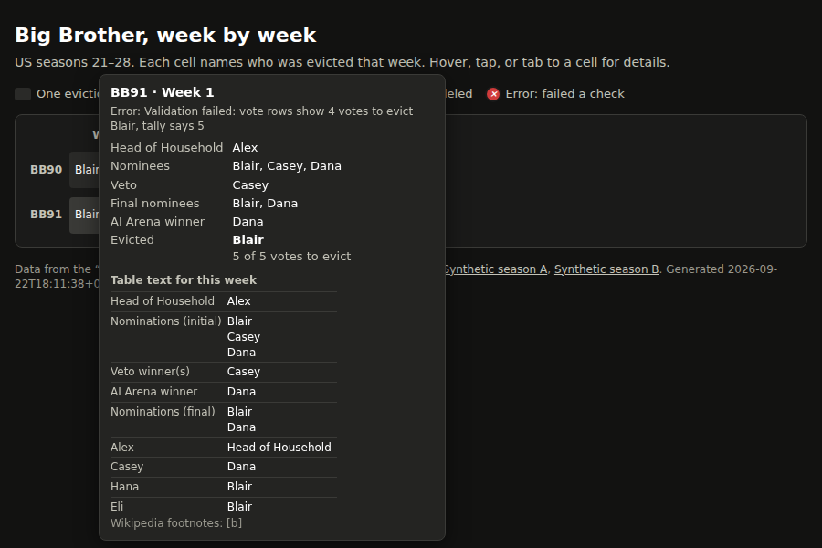
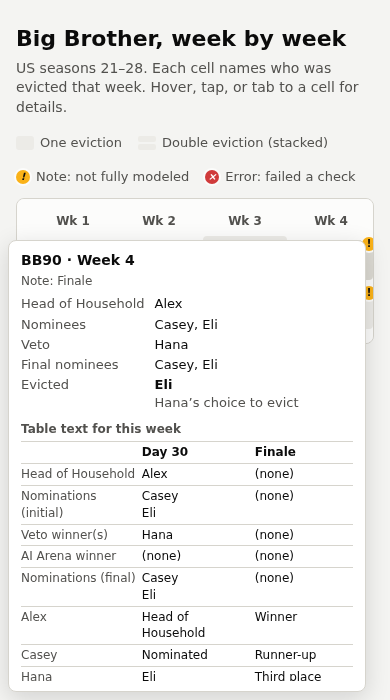

# BigBrotherDataFromWiki

A week-by-week grid of US Big Brother seasons 21–28. Each cell is one week of one season.
Hovering shows that week's HOH, nominees, veto winner(s), final nominees, who was evicted,
and the vote tally. The data comes from the "Voting history" table on each season's
Wikipedia page.

```
Wikipedia API -> fetch -> cache/ -> grid builder -> interpreter -> validator/exporter
              -> web/weeks.json + report.txt -> web/index.html
```

| Step | Module | Knows about |
|---|---|---|
| 1. Fetcher | `bbgrid/fetch.py` | the MediaWiki API (the only network code) |
| 2. Grid builder | `bbgrid/grid.py` | HTML only: finds the table, expands rowspan/colspan |
| 3. Interpreter | `bbgrid/interpret.py` | Big Brother only: row labels, weeks, rounds, statuses |
| 4. Validator + exporter | `bbgrid/validate.py`, `bbgrid/export.py` | checks each round, writes the outputs |
| 5. Web page | `web/index.html` | static page that reads `weeks.json` |

Implementation choices and open assumptions are in `docs/implementation-notes.md`.

## Screenshots

> These screenshots show **synthetic data**: made-up houseguests from
> `tests/fixtures/synthetic_season.html`, loaded as two fake seasons. The real grid has
> one row per season, BB21–BB28.

Hovering over a double-eviction week shows both rounds stacked:


An `error` week (here the vote count disagrees with the tally) shows the failed check
and the week's raw table text. Dark mode:



At phone width, tapping a cell pins its details. This is a Finale week, whose regular
column is modeled and whose Finale column is shown as raw text:



## Usage

```sh
pip install -r requirements.txt

python -m bbgrid fetch            # fetch all seasons in seasons.yaml into cache/
python -m bbgrid inspect 21 26    # print table headers and row-label mapping (for checking)
python -m bbgrid build            # cache/ -> web/weeks.json + report.txt
python -m bbgrid refresh 28       # refetch one season, then build

python -m http.server -d web      # then open http://localhost:8000
pytest
```

`report.txt` lists every week that isn't `ok`. It's the main acceptance check.

To add a season, add a line to `seasons.yaml`.

## Tests

- `tests/test_grid.py`: grid builder on small synthetic tables (rowspan, colspan, both).
- `tests/test_interpret.py`: interpreter and validator on
  `tests/fixtures/synthetic_season.html`. That table is **synthetic**: the houseguests and
  events are made up. It copies the structure the design doc describes for BB26.
- `tests/test_snapshots.py`: one snapshot per cached season in `tests/snapshots/`. A season
  with no cache file is skipped. The first run writes the snapshot. After an intended
  change, update with `UPDATE_SNAPSHOTS=1 pytest tests/test_snapshots.py`.

## Attribution

The data comes from Wikipedia under CC BY-SA 4.0. The page credits each source article
and links to the exact revision used.
