# BigBrotherDataFromWiki

A week-by-week grid of US Big Brother seasons 21–28. Each cell is one week of one season.
Hovering shows that week's HOH, noms, veto winner(s), final noms, who was evicted, and the
vote tally. The season currently airing (BB28) is on top. The grid comes from the "Voting history" table on each season's
Wikipedia page. The detail views add data from the fan-run
[Big Brother Wiki](https://bigbrother.fandom.com/) (Fandom): every competition's name,
weekly Have-Nots, houseguest bios and season facts. It's also used to cross-check Wikipedia.

## Launch the site

**Live:** <https://christopherbholland.github.io/BigBrotherDataFromWiki/>

**Publish it on GitHub Pages** (one-time setup):

1. In the repo, open **Settings → Pages** and set **Source** to **GitHub Actions**.
2. Open the **Actions** tab, choose **Publish page**, and click **Run workflow** (or just
   merge to `main`).
3. When the run finishes, the site is at the address above. It republishes by itself after
   every push to `main` that changes `web/` and after every **Fetch wiki pages** run.

**Run it locally:**

```sh
python -m http.server -d web      # then open http://localhost:8000
```

Opening `web/index.html` directly (`file://`) won't work: the page has to load
`weeks.json` over HTTP. More hosting options, phone setup and embedding are in
[`docs/integration.md`](docs/integration.md#1-host-the-page).

## How it works

```
Wikipedia API ---------> fetch -> cache/        -> grid builder -> interpreter -> validator/exporter
Big Brother Wiki API --> fetch -> cache/fandom/ -> fandom reader --------------> merge (details.json)
                                                -> web/weeks.json, details.json, report.txt -> web/index.html
```

| Step | Module | Knows about |
|---|---|---|
| 1. Fetcher | `bbgrid/fetch.py` | the MediaWiki API, for both wikis (the only network code) |
| 2. Grid builder | `bbgrid/grid.py` | HTML only: finds the table, expands rowspan/colspan |
| 3. Interpreter | `bbgrid/interpret.py` | Big Brother only: row labels, weeks, rounds, statuses |
| 4. Validator + exporter | `bbgrid/validate.py`, `bbgrid/export.py` | checks each round, writes the outputs |
| 5. Web page | `web/index.html` | static page that reads `weeks.json` |
| Big Brother Wiki reader | `bbgrid/fandom.py`, `bbgrid/wikitext.py` | the wiki's tables and infoboxes |
| Merge | `bbgrid/enrich.py` | matching the two wikis' names; adds to `details.json`, cross-checks |
| America's Favorite HouseGuest | `bbgrid/afh.py` | the infobox winner and the article's sentences about the vote |
| Shared helpers | `bbgrid/util.py` | name comparison, sentences, dates, timestamps |
| Screenshots | `tools/screenshots.py` | retakes `docs/screenshots/` from `web/` |

- **Hosting, embedding, or using the data elsewhere:** see
  [`docs/integration.md`](docs/integration.md).
- **Implementation choices and what the real tables showed:** see
  [`docs/implementation-notes.md`](docs/implementation-notes.md).

## Screenshots

These show the real data: all eight seasons as fetched from both wikis on 2026-09-22.
Houseguests appear as initials. The photos are CBS's images, and this repository links to
them rather than copying them, so the screenshots leave them out (see
[`docs/licensing.md`](docs/licensing.md)). To retake them all, run `python tools/screenshots.py`.

**A double eviction.** BB26 Week 10's two rounds are stacked in both the cell and the
tooltip. Only the second round (Angela, played in one night) is the double eviction, and
the week card says so; a week with two ordinary evictions days apart (BB27 Week 11) is
just "Two evictions":

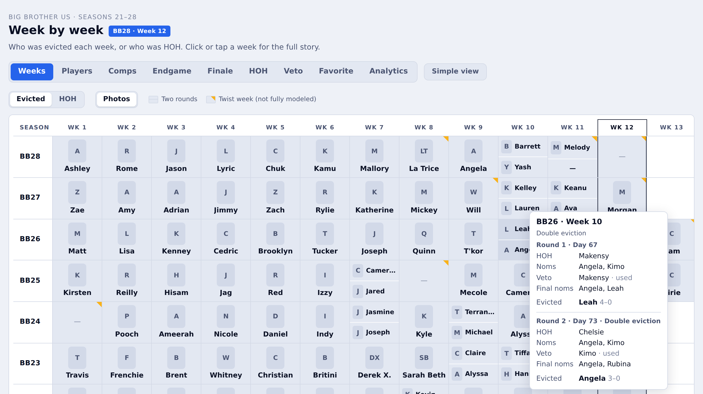

**Two rounds that aren't a double eviction.** BB24 Week 7 was the split house, with
separate "Inside" and "Outside" evictions. Both are modeled, and the note names the
columns instead of calling it a double eviction. Dark mode:

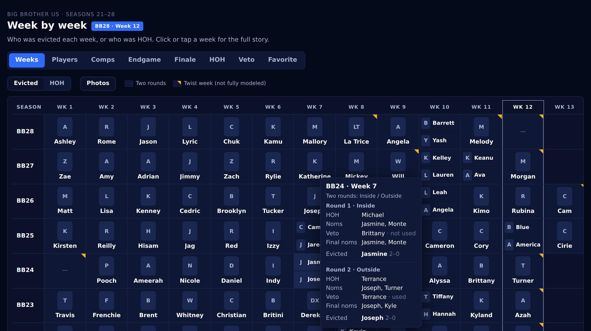

**A twist week.** Weeks with a folded yellow corner aren't fully modeled. The tooltip gives the reason and
the week's table text as Wikipedia shows it. In BB21 Week 3 the regular eviction is
modeled, and the Camp Comeback column (Cliff winning re-entry) is flagged:

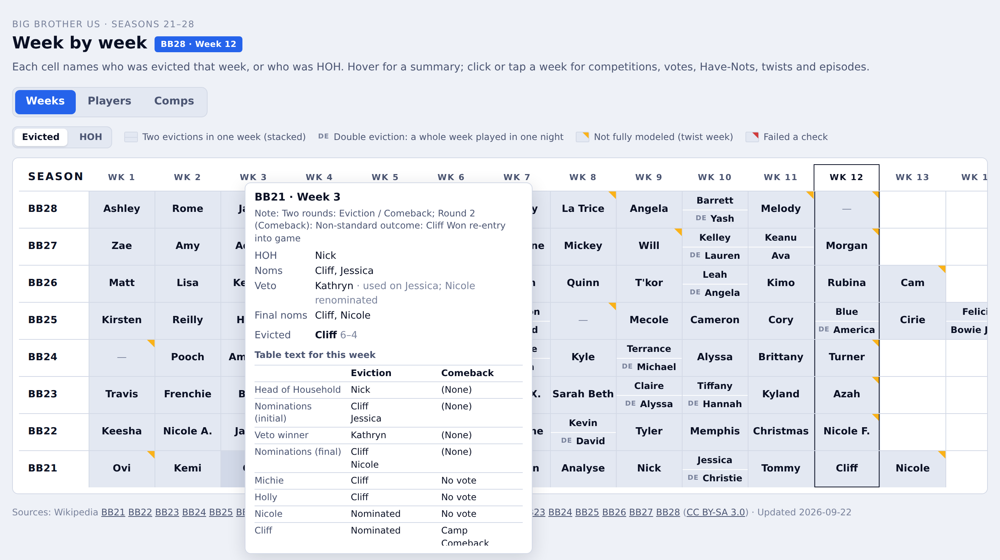

**Phone.** The grid scrolls sideways with the season labels pinned. Tapping a week opens
its details (see below).

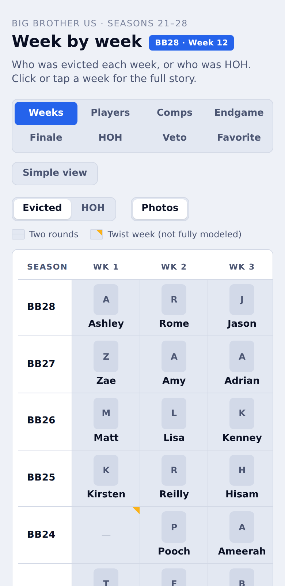

## Detail views

The main cards stay short. More detail sits behind two options:

**Click or tap a week** to open its details:
- **Summary**: the round as in the hover card: HOH, noms, the veto (used or not), twist
  rows like the Block Buster, final noms, and who was evicted by how much (`3–1`).
  Previous / next buttons (or ← →) step through the season's weeks.
- **Competitions**: the names of the HOH and veto competitions (e.g. "Eye Candy",
  "OTEV the Psychic Salamander", "The Wall"), taken from the episode summaries and tied
  to each round's winner. The summaries name them in about three weeks out of four.
- **Veto**: what was done with it (not used, used on whom, who was named as the
  replacement, or who came off the block through a twist instead), plus the episode
  summaries' own lines about the veto meeting.
- **Votes to evict**: each nominee with the houseguests who voted to evict them, A–Z.
- **Other competitions**: twists such as BB28's Time Capsule, with the power or
  punishment it gave when the episode summaries name it ("the “Diamond Power of Veto”
  power").
- **What was different**: the week's twist rows (e.g. "AI Arena: Makensy"),
  anything unusual about the eviction, and the explanatory notes Wikipedia attaches to
  that week, quoted as written. Left out when there's nothing but a Block Buster.
- **Episodes**: that week's episodes from the season's episode table, with days, air
  date, viewers, and each episode's summary (tap to expand).

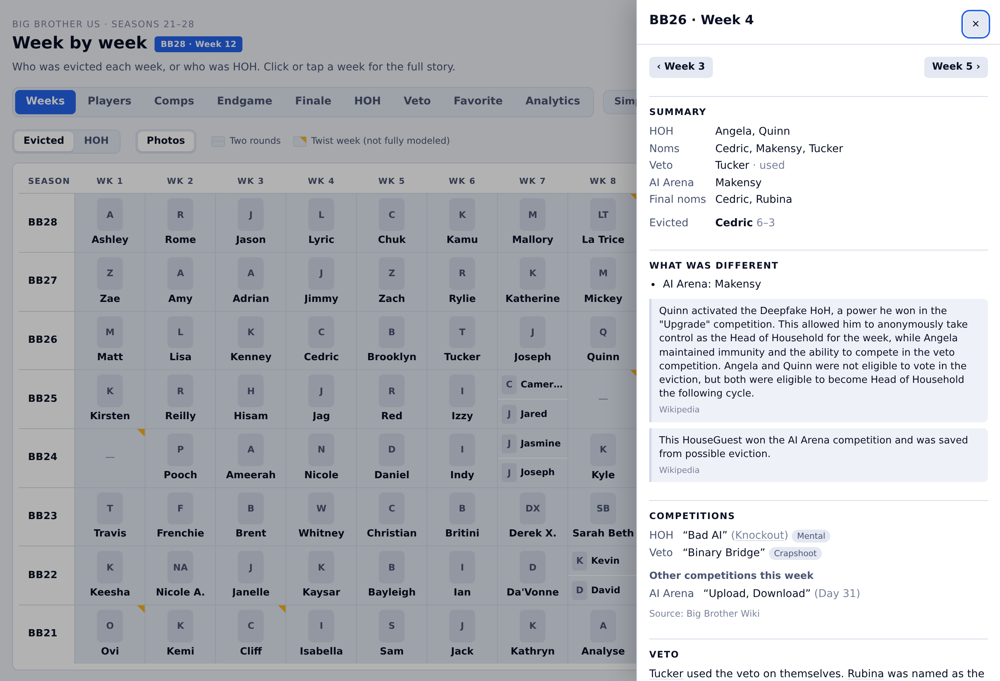

**Competitions** name every HOH and veto competition (210 of 213 rounds) from the Big
Brother Wiki's Competition History, with the recurring format where the wiki gives one
(e.g. "Bad AI" (Knockout)), linked to a page for the format, and its type. The same table lists the week's other competitions:
AI Arena, Block Buster, Safety Suite, final HOH parts and so on. Episode summaries fill in
the few names the wiki doesn't have. **Have-Nots** lists each week's Have-Nots, with who
picked them where the wiki says. **Sources disagree** appears only when the wiki's Game
History differs from Wikipedia on that week's HOH, nominations, veto winner or veto use.

**HOH view.** The Evicted / HOH switch above the grid shows whose HOH week each one was.

**Photos.** Each houseguest's headshot from the Big Brother Wiki appears in the grid (above
the evictee's or HOH's name), the players table, a player's details and the week's votes.
Players still in the game have a blue ring, the winner a gold one, and everyone else is
greyed out. The **Photos** button next to Evicted / HOH turns them off in the grid. The
pictures are linked from where the wiki keeps them, not copied; initials stand in if one
doesn't load.

**Players**: a table for each season with each houseguest's age, hometown and occupation
(from Wikipedia's cast table), then comps (HOHs, vetoes, AI Arena or Block Buster wins in
the seasons that have them, and twists: powers, safety and other twist wins), nominations,
and votes: VTE (votes to evict them), votes cast and the share cast with the house. Click
a player for a week-by-week timeline that names the competitions they won, their comp
wins by type, and whether they were saved by the veto or by a twist. From the Big Brother
Wiki it adds each player's full name, alliances and Have-Not weeks. The table also gets a
line of season facts: premiere, days, cast size, prize and host, and the season's top five
by HOH and veto wins, ranked gold, silver and bronze.

**Comps**: every HOH and veto competition of a season with its format and type
(Endurance, Physical, Skill, Mental, Hybrid, Puzzle or Crapshoot), with a count of each type.
Physical is races, obstacle courses and strength; Skill is aim, stacking and balancing
(Microbrews, Shootout, Coin Stacking); Hybrid is a question you run for, like OTEV. Click a
format (e.g. `#comp=The%20Wall`) for its page: the Big Brother Wiki's one-line summary,
how it played out (from an episode summary), a table of every play across the seasons and who won,
and a link to it on the Big Brother Wiki. Types come from the format's Big Brother Wiki
page ("a recurring endurance competition") where it names one, otherwise from the
episode summaries.

**Endgame**: the last few rounds, from the final five (or six, or four: `#endgame=26/6`),
where one veto or one vote can decide the game. A card per round tells what happened
(HOH, nominations, veto, who voted which way) and names who decided the eviction: the
sole voter, the HOH breaking a tie, or the voters in the majority. "What decided it" picks out
the final-four veto, the final HOH and the season's comp leader. A grid shows what each
houseguest did in each round, and a table sets their HOH and veto wins before the endgame
against their wins, time on the block and evictions they decided in it. Last, every
finished season's endgame side by side, with how often the big powers paid off (how many
final HOH winners won the game, how many final-four evictors made the final two). The
number left for each round is counted back from the finalists. The week details for
those rounds and the Finale view link to it.

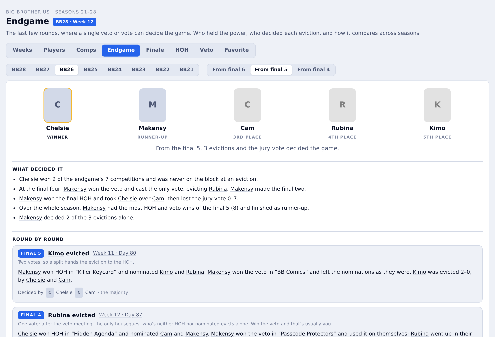

**Finale**: how each season's winner was decided. The final two and the jury vote
(`7–0`), the final HOH's three parts with their formats and winners, and who the final HOH
evicted at the final three. A vote board shows which jurors voted for whom. Then a row per juror, in the
order they left: when they were evicted, who was HOH that week, and what each finalist had to
do with it (HOH, held the veto, voted to evict). Last, the final two's games side by
side: HOH and veto wins, final HOH parts, nominations, votes against, and how many jurors
each helped evict. The votes are counted from each juror's own cell in Wikipedia's Finale
column. The table's own "N votes to win" line isn't used because it can be wrong (BB22's reads
"Enzo 0 votes to win"). While a season is airing the view shows who's left and the
jury so far. The finale week's details link to it.

**Favorite**: America's Favorite HouseGuest for every season, the viewers' vote announced
at each finale. Each season's card shows the winner, the prize, how their game ended
(juror, out before the jury, or winner, like BB24's Taylor), who else placed where the article
says ("Top 3 in the vote: Tucker, Angela, Quinn"), and Wikipedia's own sentences about
the vote, such as "with over 65% of the vote". The winner comes from Wikipedia's
infobox and is checked against the Big Brother Wiki, which also gives the prize. The
Finale view ends with the season's favorite, the Players table tags them `AFH`, and a
player's details say "America's Favorite: Won ($50,000)" or "Top 3".

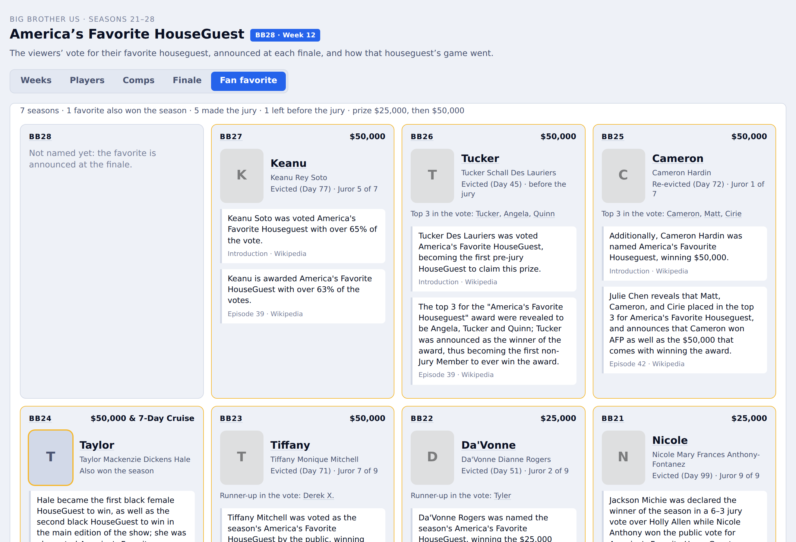

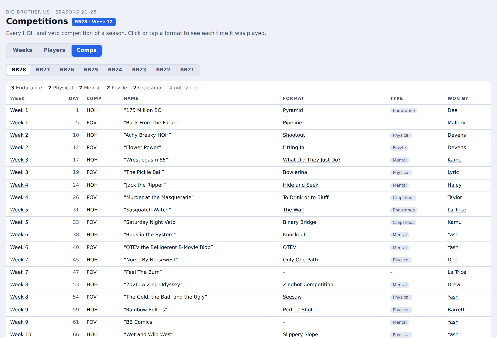

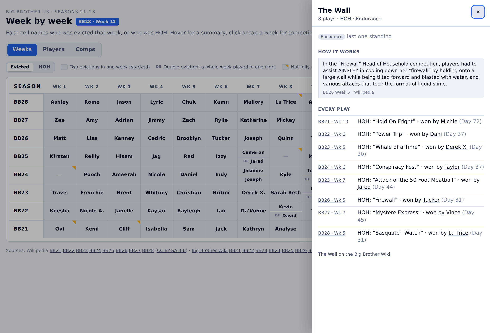

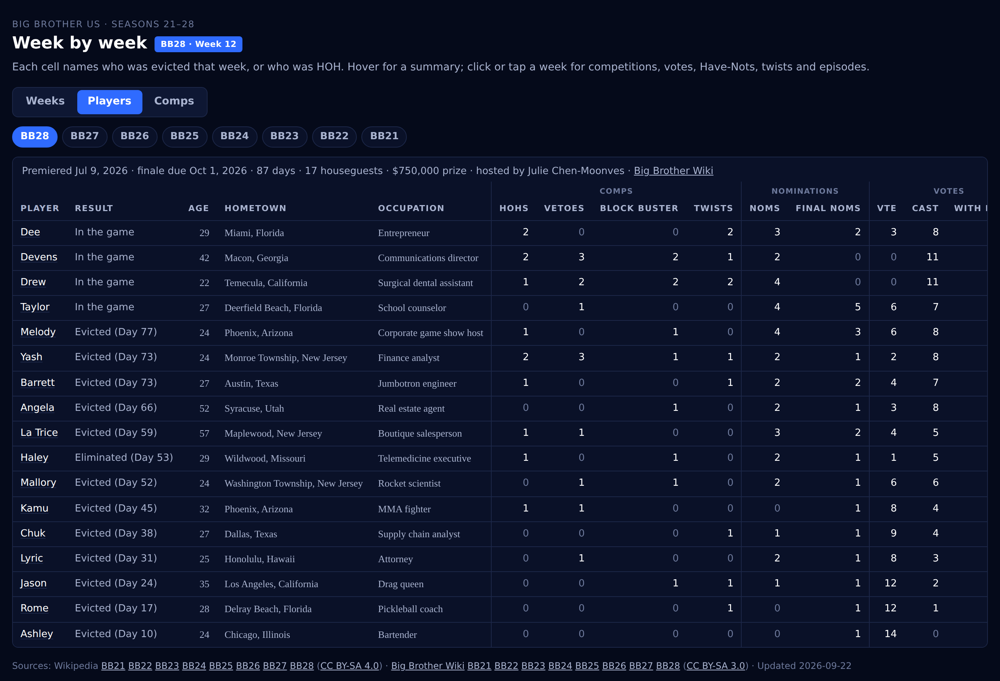

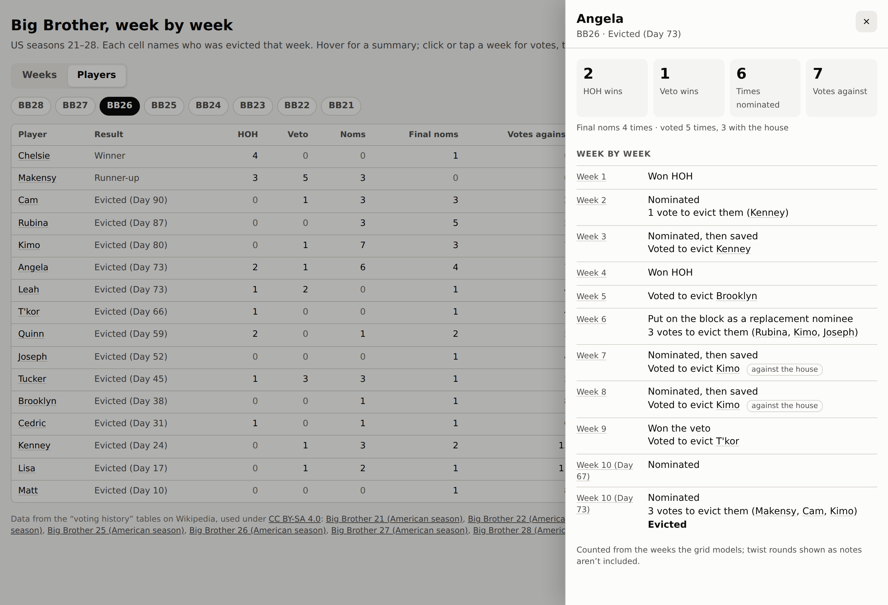

On a phone, details open as a bottom sheet:

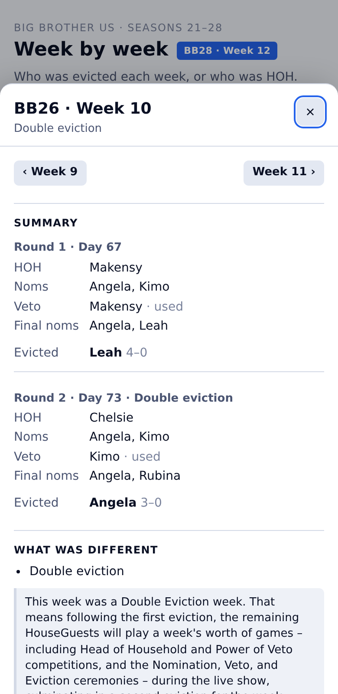

Every view has its own link, e.g. `#week=26/Week%204`, `#players=28`,
`#player=26/Angela`, `#comps=28`, `#comp=The%20Wall`, `#endgame=26`, `#finale=26` or `#afh`, so it can be shared or embedded directly. The detail data lives in
`web/details.json`, which loads only when a detail view is first opened.

## Usage

```sh
pip install -r requirements.txt

python -m bbgrid fetch            # fetch all seasons in seasons.yaml into cache/, from both wikis
                                  # (or run the "Fetch wiki pages" GitHub Action)
python -m bbgrid inspect 21 26    # print table headers and row-label mapping (for checking)
python -m bbgrid build            # cache/ -> web/weeks.json, web/details.json, report.txt
python -m bbgrid refresh 28       # refetch one season, then build
python -m bbgrid proofread        # web/*.json -> proofread.xlsx, a sheet for checking every fact
python -m bbgrid inspect-fandom 26  # what was read from the cached Big Brother Wiki page

python -m http.server -d web      # then open http://localhost:8000
pytest
python tools/screenshots.py       # retake docs/screenshots/ (needs `pip install playwright`)
```

`report.txt` lists every week that isn't `ok`. It's the main acceptance check. A "Big Brother
Wiki" block near the top lists anything that didn't line up: disagreements with Wikipedia,
houseguests with no wiki page, and names the reader couldn't match.

To add a season, widen the range in `seasons.yaml` (e.g. `seasons: "21-29"`). Page titles
come from the patterns under `titles` ("Big Brother {n} (American season)" on Wikipedia,
"Big Brother {n} (US)" on the Big Brother Wiki), with `exceptions` for any page named
differently. Older seasons work the same way. [`docs/all-seasons.md`](docs/all-seasons.md)
says what's ready and what to check before building BB1–BB20.

## Integrating

The page is one static HTML file plus `weeks.json`, so it can go anywhere:

- **Host it** on GitHub Pages: `.github/workflows/pages.yml` publishes `web/`, so you can use it from a phone. See [Launch the site](#launch-the-site) for setup.
- **Embed it** in another site with an iframe; `?embed=1` hides the page's title:
  ```html
  <iframe src="https://<user>.github.io/BigBrotherDataFromWiki/?embed=1"
          title="Big Brother week-by-week grid"
          style="width:100%;height:560px;border:0" loading="lazy"></iframe>
  ```
- **Use the data**: `web/weeks.json` has one record per season-week, with every field
  documented.
- **Keep it fresh** by running the **Fetch wiki pages** action. It refetches the
  pages from both wikis, rebuilds `weeks.json` and `details.json`, and commits the changes.

Step-by-step instructions, including GitHub Pages setup and the full data
format, are in [`docs/integration.md`](docs/integration.md).

## Tests

- `tests/test_grid.py`: grid builder on small synthetic tables (rowspan, colspan, both).
- `tests/test_interpret.py`: interpreter and validator on
  `tests/fixtures/synthetic_season.html`. That table is **synthetic**: the houseguests and
  events are made up. It copies the structure the design doc describes for BB26.
- `tests/test_comps.py`: Wikipedia's cast table, competition descriptions and types, and
  matching a competition to its round.
- `tests/test_details.py`: votes, what was different, player stats, footnote text and
  episode parsing.
- `tests/test_fandom.py`, `tests/test_wikitext.py`: the Big Brother Wiki reader and
  merge on `tests/fixtures/fandom_season.html`, a **synthetic** page (made-up houseguests)
  that copies the real pages' structure; name matching; the cross-check.
- `tests/test_fandom_snapshots.py`: one snapshot per cached Big Brother Wiki season
  (`tests/snapshots/fandom_bbNN.json`), updated the same way as below.
- `tests/test_snapshots.py`: one snapshot per cached season in `tests/snapshots/`. A season
  with no cache file is skipped. The first run writes the snapshot. After an intended
  change, update with `UPDATE_SNAPSHOTS=1 pytest tests/test_snapshots.py`.
- `tests/test_afh.py`: America's Favorite HouseGuest on a **synthetic** page: the
  infobox winner, the top three or runner-up, the prize and the cross-check.
- `tests/test_config.py`: `seasons.yaml` ranges, title patterns and exceptions.
- `tests/test_export.py`: the whole build for one cached season, written to a temporary
  folder: the top-level shape of `weeks.json` and `details.json`, and `report.txt`.

The **Tests** GitHub Action (`.github/workflows/tests.yml`) runs `pytest` on every pull
request and push to `main`. It then rebuilds `web/` from `cache/` and fails if the committed
`weeks.json`, `details.json` or `report.txt` differ from the rebuild. After a code change
that alters the data, run `python -m bbgrid build` and commit the result with it.

## Attribution and license

The grid's data comes from Wikipedia under CC BY-SA 4.0. The detail views also use the
Big Brother Wiki (bigbrother.fandom.com) under CC BY-SA 3.0. The page credits each source
article on both wikis and links to the exact revision used. The data in this repository
(`web/*.json`, `proofread.xlsx`, `report.txt`, `cache/`) is shared under CC BY-SA 4.0: see
[`DATA_LICENSE.md`](DATA_LICENSE.md). Houseguest photos are CBS promotional images, not
CC BY-SA content: the page links to them on the Big Brother Wiki (it doesn't copy them) and
credits them in its footer. [`docs/licensing.md`](docs/licensing.md) is the full review of
what's used and how. *Big Brother* is a trademark of its owners, and this project isn't
affiliated with CBS or the show's producers.
